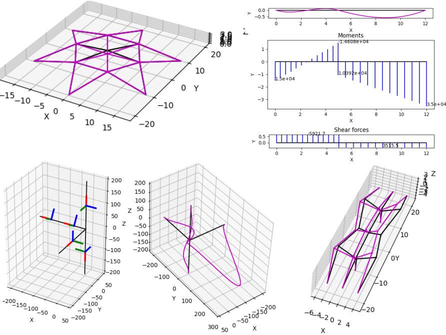

# pystran: Python for Structural Analysis

A simple structural analysis tool in Python, for structures consisting of truss
and beam members, springs, and rigid bodies, both in two dimensions and in three dimensions.




## News

- 03/13/2025: Update documentation for the sphinx system.
- 03/10/2025: Add rigid links and general springs.


[Past news](#past-news)

## Features & Limitations


- The package analyzes two-dimensional and three-dimensional structures made up
  of truss (axial) members and beams (even in combination), rigid links, and
  general springs. Concentrated masses can be added at joints.
- Linear statics and dynamics (free vibration) solvers are included.
- Only elastic models can be solved.
- For beams, only the Bernoulli-Euler model is implemented, so no shear
  deformation is taken into account.
- Only straight members are treated.
- It is assumed that there is no coupling between the bending actions in the
  two orthogonal planes.
- Coupling of axial and bending action is not implemented. This means that the
  neutral axis must pass through the centroid.
- Warping of the cross sections is not modelled, hence only free torsion
  effects are included.
- Member loading is not considered. All member loading needs to be converted to
  nodal forces.
- Internal hinges can be modelled with linked joints. No member end releases
  are implemented.
- Degrees of freedom are only along the global Cartesian axes. Skew supports
  are not included (except with a penalty method based on springs)
- Offsets of the beams from the joints are currently not implemented.
- Rigid links between pairs of joints can be modeled with a penalty approach.


## Requirements

`pystran` depends on the following Python packages: 
- NumPy
- SciPy
- Matplotlib

These requirements can be easily satisfied by running the examples in the [Spyder IDE](docs/spyder/spyder.md).

## Documentation

Documentation of the package is provided in these [HTML page](https://petrkryslucsd.github.io/pystran).

More details about the generation of the documentation are [here](docs/make_docs.md).

## Running

This package is not distributed through the official Python channels.
It needs to be downloaded from GitHub as a zip file, and expanded in some convenient location. 

The __`pystran` folder__ can be located by looking for this README.md file.

The easiest way to run a pystran example is to download and install Spyder 6.
[Detailed instructions](docs/spyder/spyder.md) are provided. 

It is also possible to run simulations using a [plain Python in a terminal](docs/terminal/terminal.md).


## Tutorials

Step-by-step tutorials are available in the [`tutorials`](./tutorials) folder. 
For example, run tutorials in the `pystran/tutorials` in the terminal  as 
```
py tutorials/01_three_bars_tut.py
```

Or, [use Spyder](docs/spyder/spyder.md), which makes the whole process a lot easier to set up.


## Testing

In the `pystran/tests` folder, run 
```
py unittests_planar_truss.py 
```
and analogously for the other unit test files.

## <a name="past-news"></a>Past news

- 03/05/2025: Describe the operation of the scripts.
- 02/12/2025: Make it possible to use general joint and member identifiers.
- 02/05/2025: Add general springs to ground.
- 01/30/2025: Add tutorials.
- 01/22/2025: Implement initial functionality. 
