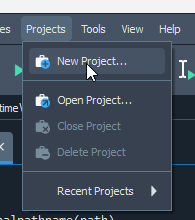
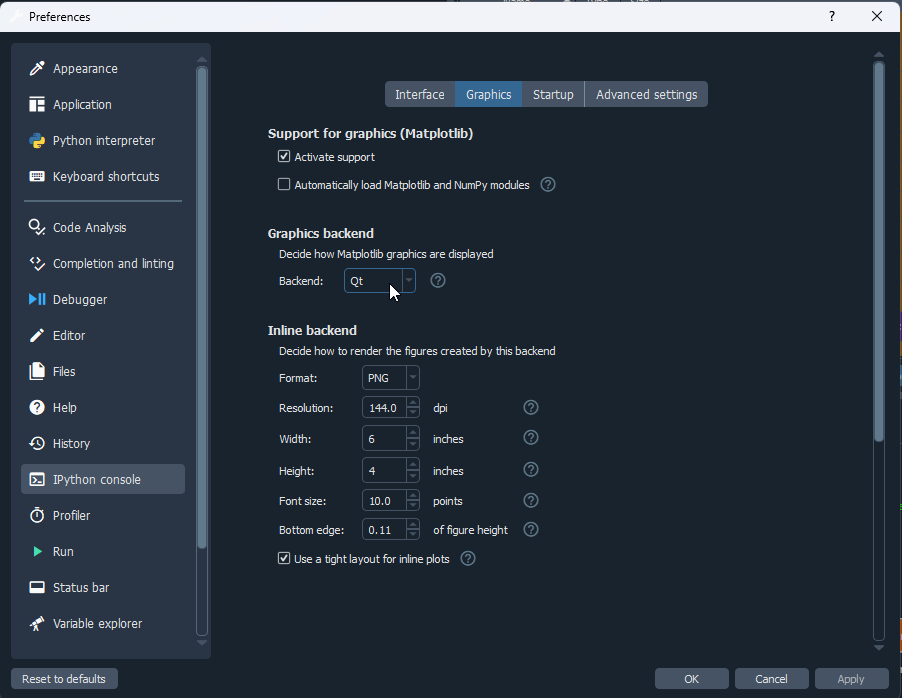

# Using `pystran` with Spyder

The easiest way to run a `pystran` example is to download and install [Spyder
6](https://www.spyder-ide.org/). It is a complete IDE for Python,
including a very capable debugger. Just open an example and click the run
button.

The detailed instructions are as follows:

Create new project in Spyder.

Create the project from an "existing" folder, i.e. `pystran` top folder.

Make sure the project pane is showing.

Then start a console in the folder where your script is located.

Open a tutorial.

Run the tutorial by clicking the green arrow button.
Or, debug the tutorial by clicking the button with the blue arrow and two vertical bars (run-and-pause).

## Plotting

By default the IDE will display the plots in the graphics pane.
The plots are then static -- they cannot be interacted with.

If that is not what we want, we should change the graphics settings as

That will open interactive windows for all the plots outside of the editor.